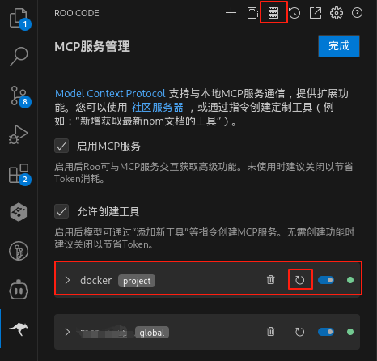
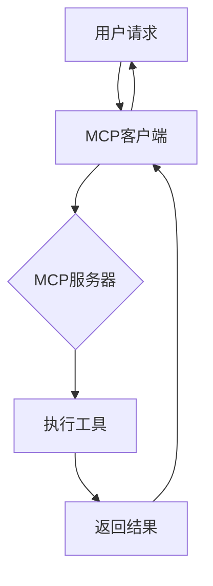

# 🚀 openEuler DevStation MCP Servers 实战指南

<div align="center">
✨ <strong>让大模型拥有操作系统超能力</strong> ✨
</div>

## 🔧 如何创建一个MCP Server (2分钟快速体验)

每个MCP Server只需要2个核心文件：

1. `mcp_config.json` - 服务配置
2. `server.py` - 服务实现

```bash
my_mcp_server/
├── mcp_config.json   # 服务配置
└── src/
    └── server.py     # 服务实现
```

### 🚀 超简单系统信息查询MCP Server

1. 创建目录结构
```bash
mkdir -p docker_mcp/src
cd docker_mcp
```
2. 创建server.py
```bash
cat > $(pwd)/src/server.py <<EOF
#!/usr/bin/env python3
import subprocess
import shlex
import json
from mcp.server.fastmcp import FastMCP

mcp = FastMCP("用来执行docker相关命令")

@mcp.tool()
def get_docker_list() -> dict:
    """统计当前机器上已有哪些容器"""
    try:
        # 执行docker ps令并返回
        result = subprocess.check_output(['sudo', 'docker', 'ps', '-a'], 
                                        text=True, 
                                        stderr=subprocess.STDOUT)
        
        return result
    except subprocess.CalledProcessError as e:
        return e
    except Exception as e:
        return e
if __name__ == "__main__":
    # Initialize and run the server
    mcp.run()
EOF
```

3. 创建mcp_config.json
```bash
cat > $(dirname $(pwd))/.roo/mcp.json <<EOF
{
    "mcpServers": {
      "docker": {
        "command": "uv",
        "args": [
          "--directory",
          "$(pwd)/src",
          "run",
          "server.py"
        ],
        "disabled": false,
        "autoApprove": [],
        "alwaysAllow": []
      }
    }
}
EOF
```

4. 运行MCP Server
在Roo Code/EulerCopilot(MCP 客户端)中配置MCP servers


### 🎮 立即体验 - 试试问问AI这些问题:

```bash
# 查询容器信息
帮我查询一下环境上有哪些容器？
```

### 🎉 恭喜! 您已创建第一个MCP Server!

现在可以尝试:
- 添加更多系统信息查询功能
- 修改为其他有趣的功能
- 提交PR到openEuler mcp-servers(https://gitee.com/openeuler/mcp-servers)仓库分享您的创作!

扫二维码可以直接关注mcp-servers代码仓

> 💡 小贴士: 在openEuler展台,您可以现场完成这个示例并立即看到效果!

## 🌟 现有MCP服务器能力展示

### 1. oeDeploy
🛠️ **功能**: openEuler一键部署工具  
🔧 **工具**:
- 安装/卸载oeDeploy
- 插件管理
- 一键软件部署

### 2. oeGitExt
📊 **功能**: openEuler社区数据查询  
🔧 **工具**:
- 查询issue
- 查找PR
- 项目统计

### 3. GNOME Wallpaper
🎨 **功能**: GNOME桌面定制  
🔧 **工具**:
- 更换壁纸
- 预设主题切换

### 4. oeDevPlugin Builder
⚙️ **功能**: 开发插件构建  
🔧 **工具**:
- 打包tar.gz
- 一键构建RPM

## 🎬 MCP工作流程演示



## 🚀 快速体验

1. 安装MCP客户端(Roo Code/EulerCopilot)
2. 配置现有MCP服务器
3. 开始与大模型交互!

> 💡 提示: 在openEuler DevStation中已预置了这些MCP服务器，开箱即用!