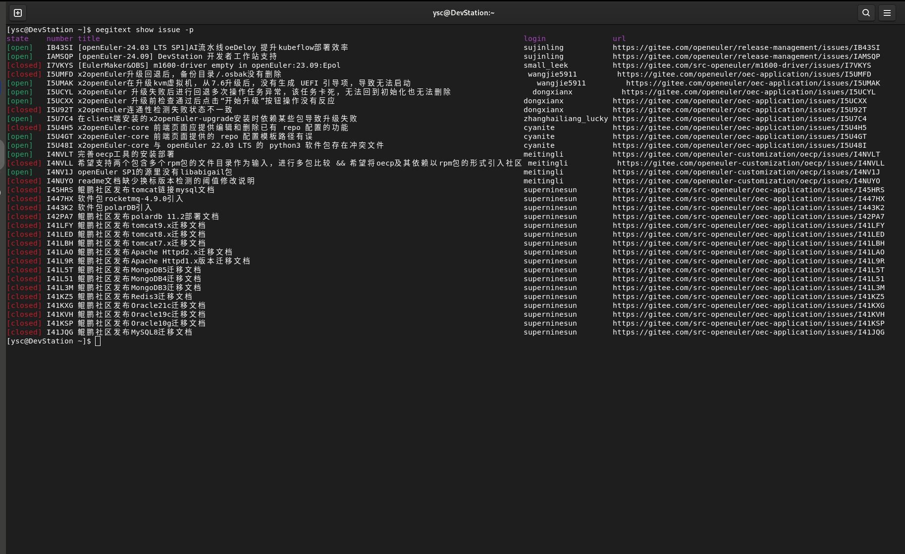
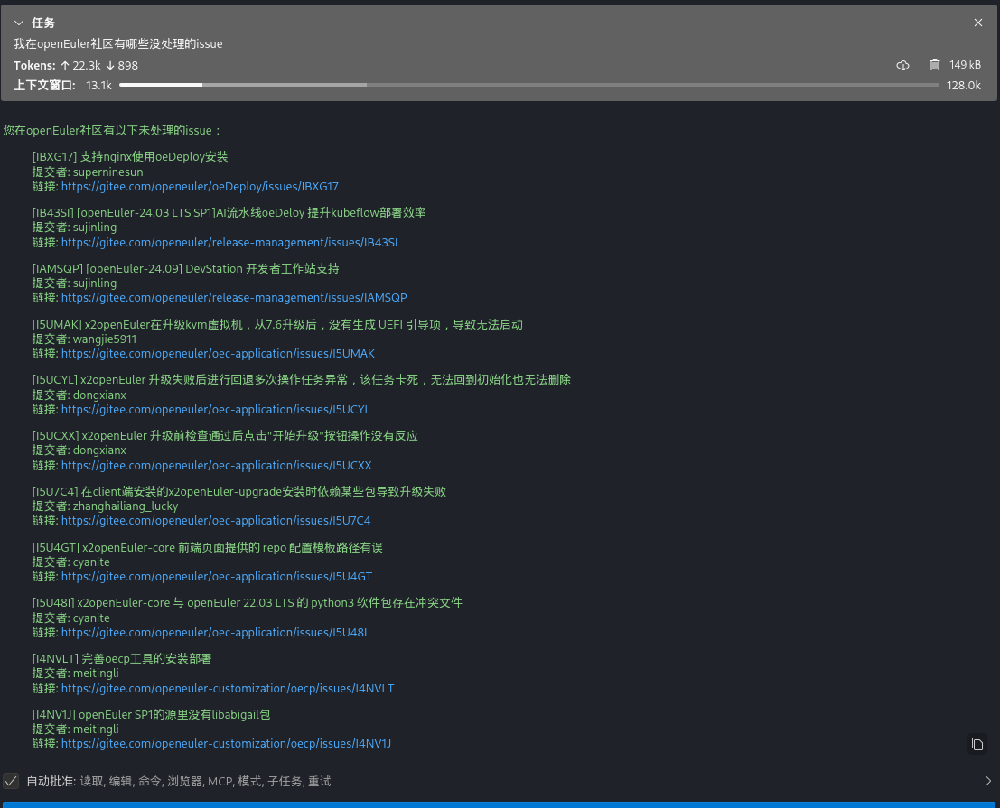

# openEuler MCP Servers仓库，欢迎大家贡献

#### 介绍
MCP是Model Context Protocol的缩写，旨在提供一个通用的大模型上下文协议，用来调用各种应用，拓展大模型能力，openEuler的mcp-servers仓库用来存放各种MCP Server，聚焦于操作系统领域，结合Devstation，EulerCopilot改善openEuler交互体验

#### 软件架构
仓库目录带一个doc目录，用来存放整体的各类文档介绍，之后每个文件夹为一个独立的MCP Server
|----doc
|----oeDeploy
|----xxxxx

以oeDeploy为例，每个仓库顶层需要包含以下几个内容：
1、该MCP Server实现了哪些功能，如何使用该MCP Server能力
2、MCP配置的json文件
3、源码


#### 使用说明

1、使用常用的MCP客户端完成配置如EulerCopilot，Roo Code，Cline等等
2、将MCP Server的配置文件写入到MCP客户端

##### 未来openEuler 430版本：
openEuler社区会将每个MCP Server构建为一个个RPM包，用户直接yum install安装即可使用

#### 快速开始：如何使用MCP Python-SDK编写一个自己的MCP Server服务器
##### 1、挑选一个小工具oegitext
oegitext是一个用来和gitee交互的小工具，可以用来查询在gitee上面的一些仓库和issue，查询一些PR信息：

##### 2、使用python-sdk进行一个改造
下面是代码的一个简单示例：
```python
import subprocess
from mcp.server.fastmcp import FastMCP

mcp = FastMCP("查找openEuler社区的issue")

@mcp.tool()
def get_my_openeuler_issue() -> str:
    """统计我在openEuler社区所负责的issue"""
    try:
        # 执行oegitext命令并解析结果
        result = subprocess.check_output(['oegitext', 'show', 'issue', '-p'], 
                                        text=True, 
                                        stderr=subprocess.STDOUT)
        
        return result
    except subprocess.CalledProcessError as e:
        return e
    except Exception as e:
        return e

if __name__ == "__main__":
    # Initialize
    mcp.run()
```
##### 3、openEuler MCP环境搭建
待补充，后续使用yum安装即可
##### 4、MCP Client调用效果


