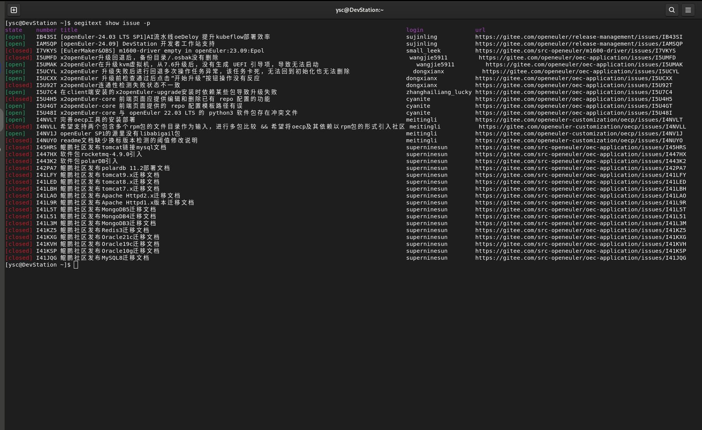

# openEuler MCP Servers仓库，欢迎大家贡献

<div align="center">

<strong>openEuler MCP Servers 仓库</strong>

[![PyPI][pypi-badge]][pypi-url]
[![Python Version][python-badge]][python-url]
[![Documentation][docs-badge]][docs-url]
[![Specification][spec-badge]][spec-url]


</div>


[pypi-badge]: https://img.shields.io/pypi/v/mcp.svg
[pypi-url]: https://pypi.org/project/mcp/
[python-badge]: https://img.shields.io/pypi/pyversions/mcp.svg
[python-url]: https://www.python.org/downloads/
[docs-badge]: https://img.shields.io/badge/docs-modelcontextprotocol.io-blue.svg
[docs-url]: https://modelcontextprotocol.io
[spec-badge]: https://img.shields.io/badge/spec-spec.modelcontextprotocol.io-blue.svg
[spec-url]: https://spec.modelcontextprotocol.io

## 介绍

MCP是Model Context Protocol的缩写，旨在提供一个通用的大模型上下文协议，用来调用各种应用，拓展大模型能力，openEuler的mcp-servers仓库用来存放各种MCP Server，聚焦于操作系统领域，结合Devstation，EulerCopilot改善openEuler交互体验

## 软件架构
仓库目录带一个doc目录，用来存放整体的各类文档介绍，之后servers每个文件夹为一个独立的MCP Server

```python
mcp-servers/
├── servers
|      |──oeDeploys
|           |── readme.md
|           |── mcp_config.json
|           └── src
|      |──oeGitExt 
|      └──xxxxx
└── doc
```

以oeDeploy为例，每个server顶层需要包含以下几个内容：

1、该MCP Server实现了哪些功能，如何使用该MCP Server能力

2、MCP配置的json文件

3、源码


## 使用说明

1、使用常用的MCP客户端完成配置如EulerCopilot，Roo Code，Cline等等

2、将MCP Server的配置文件写入到MCP客户端

### 使用yum自动安装（推荐）：
openEuler社区会将每个MCP Server构建为一个个RPM包，用户直接yum install安装即可使用，即将上线

## 快速开始：如何使用MCP Python-SDK编写一个自己的MCP Server服务器
### MCP环境搭建
### 1、安装 `uv` Python管理工具
```shell 
yum install -y uv
```

### 2、安装MCP
```shell
yum install -y python3-mcp
```

### 实战编码
### 1、挑选一个小工具oegitext
oegitext是一个用来和gitee交互的小工具，可以用来查询在gitee上面的一些仓库和issue，查询一些PR信息：
该工具在DevStation上预安装，如果没有安装，可以在配置openEuler-25.03 EPOL仓库后使用 `yum install oegitext安装`
安装完成之后，使用如下命令配置gitee令牌：
```shell
oegitext config -token ${access_token}
```
之后使用`oegitext show issue -p`查询当前issue：

### 2、使用python-sdk进行一个改造
在上面使用uv创建的虚拟环境中，新建一个oegitext_mcp.py文件
下面是代码的一个简单示例：
```python
import subprocess
from mcp.server.fastmcp import FastMCP

mcp = FastMCP("查找openEuler社区的issue")

@mcp.tool()
def get_my_openeuler_issue() -> str:
    """统计我在openEuler社区所负责的issue"""
    try:
        # 执行oegitext命令并解析结果
        result = subprocess.check_output(['oegitext', 'show', 'issue', '-p'], 
                                        text=True, 
                                        stderr=subprocess.STDOUT)
        
        return result
    except subprocess.CalledProcessError as e:
        return e
    except Exception as e:
        return e

if __name__ == "__main__":
    # Initialize
    mcp.run()
```
### 3、openEuler MCP环境搭建
打开DevStation预安装的vscodium软件，在插件市场里安装Roo Code（后续也可以使用EulerCopilot实现）
在设置当中配置大模型，我们使用的是DeepSeeK V3的API：
```json
API提供商：OpenAI Compatible
OpenAI基础URL：https://api.siliconflow.cn
密钥：对应的密钥
模型：Pro/deepseek-ai/DeepSeek-V3   #可以自己选择合适的模型
```
在Roo Code插件上方的选项卡里选择MCP服务器
点击编辑全局MCP
```json
{
  "mcpServers": {
    "oegitext_mcp": {
      "command": "/usr/bin/uv",
      "args": [
        "--directory",
        "/home/xxx/oegitext_mcp",
        "run",
        "--python",
        "/usr/bin/python3",
        "oegitext_mcp.py"
      ],
      "disabled": false,
      "autoApprove": [],
      "alwaysAllow": []
    },
  }
}
```
上面的路径修改成正确的实际路径，之后保存，点击完成

### 4、MCP Client调用效果


