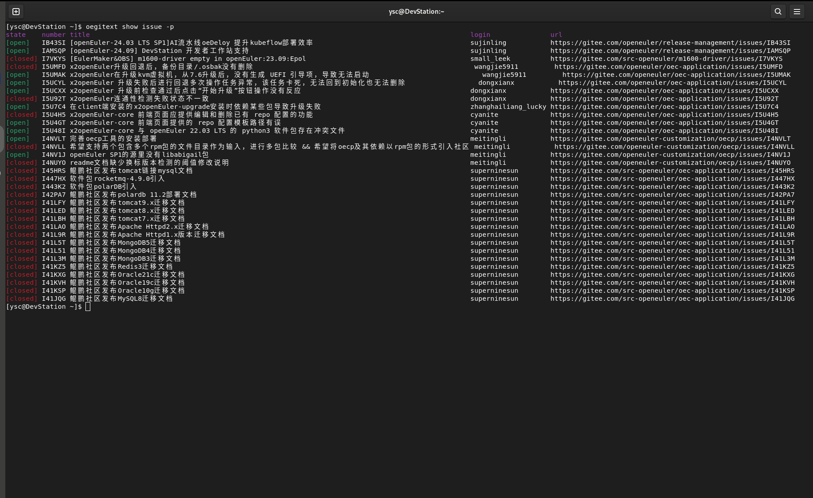
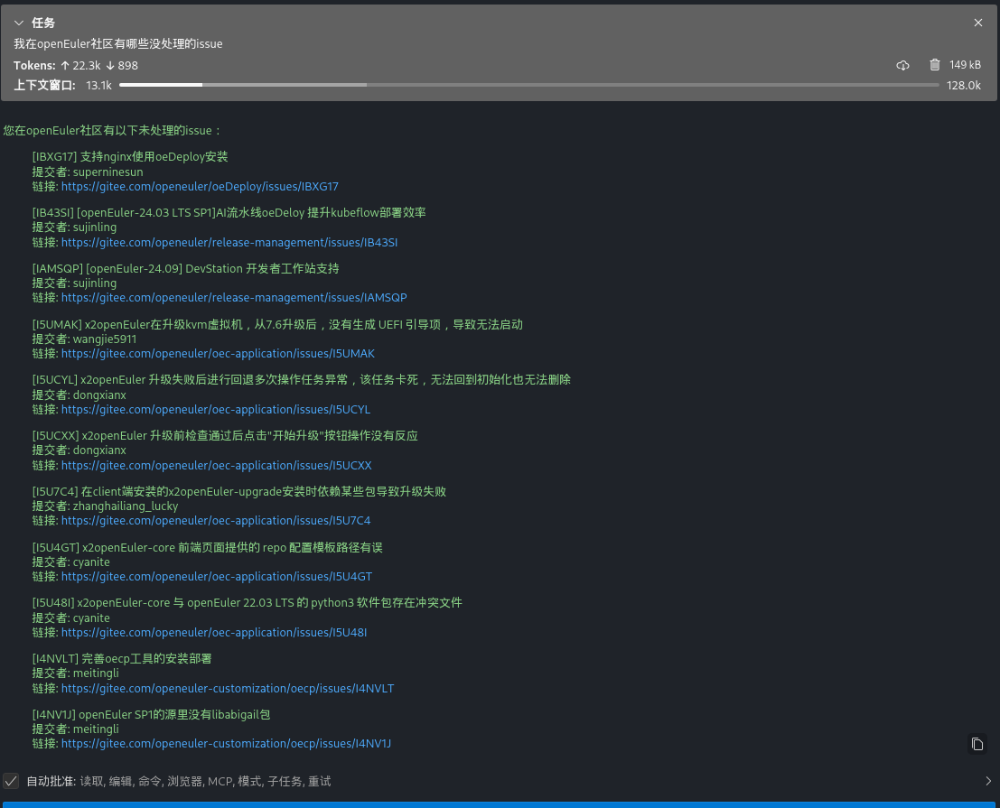

# openEuler mcp-servers Repository

<div align="center">
<strong>openEuler mcp-servers Repository</strong>

[![PyPI][pypi-badge]][pypi-url]
[![Python Version][python-badge]][python-url]
[![Documentation][docs-badge]][docs-url]
[![Specification][spec-badge]][spec-url]

</div>

[pypi-badge]: https://img.shields.io/pypi/v/mcp.svg
[pypi-url]: https://pypi.org/project/mcp/
[python-badge]: https://img.shields.io/pypi/pyversions/mcp.svg
[python-url]: https://www.python.org/downloads/
[docs-badge]: https://img.shields.io/badge/docs-modelcontextprotocol.io-blue.svg
[docs-url]: https://modelcontextprotocol.io
[spec-badge]: https://img.shields.io/badge/spec-spec.modelcontextprotocol.io-blue.svg
[spec-url]: https://spec.modelcontextprotocol.io

## Introduction

MCP stands for Model Context Protocol. It aims to provide a universal protocol for foundation model context, enabling the invocation of various applications and extending the capabilities of foundation models. The openEuler **mcp-servers** repository stores different MCP servers, focusing on the operating system domain and improving the openEuler interaction experience together with DevStation and openEuler Intelligence.

## Software Architecture

The repository contains a **doc** directory for documentation. Each folder under **servers** represents an independent MCP server.

```python
mcp-servers/
├── servers
│   ├── oeDeploys/
│   │   ├── mcp_config.json
│   │   ├── mcp-rpm.yaml
│   │   └── src/
│   │       ├── icon.png
│   │       ├── mcp-oedp.py
│   │       ├── readme.md
│   │       └── requirements.txt
│   ├── oeGitExt/
│   └── xxxxx/
├── scripts/
└── doc/
```

Using **oeDeploy** as an example, each server directory must include:

1. **MCP configuration file** — contains MCP server configurations

2. **Deployment configuration file** — contains other related configuration files

3. **Source code directory** — contains the implementation code and resource files of the MCP server

The  [MCP Description](./doc/mcp_suggest.md ) in the **doc** directory provides recommended guidelines to improve the usability of MCP servers.

## Usage Instructions

1. Configure an MCP client such as openEuler Intelligence, Roo Code, Cline, etc.

2. Add the MCP server configuration file to the MCP client.

### Automatic Installation via yum (Recommended)

The openEuler community will package each MCP server as an RPM file. Users will be able to install them directly using **yum install** (coming soon).

## Quick Start: How to Build Your Own MCP Server Using the MCP Python SDK

### MCP Environment Setup

### 1. Install the `uv` Python management tool.

```shell 
yum install -y uv
```

### 2. Install MCP.

```shell
yum install -y python3-mcp
```

### Practical Example

### 1. Choose a small tool — oegitext.

oegitext is a small tool for interacting with Gitee. It can query repositories, issues, and PR information. It is preinstalled on DevStation. If not installed, you can install it using **yum install oegitext** after enabling the openEuler-25.03 EPOL repository.
After installation, configure your Gitee token:

```shell
oegitext config -token ${access_token}
```
Then run **oegitext show issue -p** to query the issues:


### 2. Modify it using the Python SDK.

In the virtual environment created with **uv**, create a new file **oegitext_mcp.py**. Below is a simple example:

```python
import subprocess
from mcp.server.fastmcp import FastMCP

mcp = FastMCP("Query issues in the openEuler community.")

@mcp.tool()
def get_my_openeuler_issue() -> str:
    """Collect statistics on the issues that I am responsible for in the openEuler community."""
    try:
        # Run the oegitext command and parse the result.
        result = subprocess.check_output(['oegitext', 'show', 'issue', '-p'], 
                                        text=True, 
                                        stderr=subprocess.STDOUT)
        
        return result
    except subprocess.CalledProcessError as e:
        return e
    except Exception as e:
        return e

if __name__ == "__main__":
    # Initialize
    mcp.run()
```

### 3. Set up the openEuler MCP environment.

Open the preinstalled **vscodium** on DevStation and install the **Roo Code** extension (openEuler Intelligence can also be used later). Configure the foundation model in settings. Here we use the DeepSeek V3 API:

```json
API Provider: OpenAI Compatible
OpenAI Base URL: https://api.siliconflow.cn
API Key: your key
Model: Pro/deepseek-ai/DeepSeek-V3   # You can select a desired model.

```

In Roo Code, open the MCP Server tab and edit the global MCP configuration:

```json
{
  "mcpServers": {
    "oegitext_mcp": {
      "command": "/usr/bin/uv",
      "args": [
        "--directory",
        "/home/xxx/oegitext_mcp",
        "run",
        "--python",
        "/usr/bin/python3",
        "oegitext_mcp.py"
      ],
      "disabled": false,
      "autoApprove": [],
      "alwaysAllow": []
    },
  }
}
```

Modify the paths as needed, save, and finish.

### 4. Check the MCP client invocation result.


