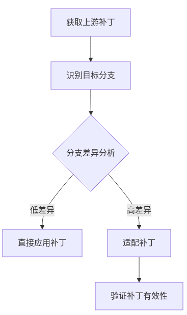

 # CVE高效处理平台设计文档

## 当前流程主要存在以下痛点：

1. 流程分散在多个平台(gitee、Eulermaker、NVD等)，缺乏统一入口
2. 大量手动操作(查找补丁、验证补丁、提交PR等)，效率较低
3. 缺乏自动化工具支持，如自动检测受影响版本、自动验证补丁等
4. 状态跟踪困难，需要人工在不同平台间切换查看
5. 缺乏数据统计和分析能力


基于这些痛点，设计CVE高效处理平台需要考虑以下关键功能：

1. 统一入口和流程管理
2. 自动化工具链集成
3. 状态跟踪和可视化
4. 数据统计和分析

主要用户角色包括：

1. 安全工程师：负责CVE分析和修复
2. 维护者：负责代码审查和合并
3. 社区管理员：负责整体CVE管理
4. 普通开发者：关注与自己相关包的CVE

## 一、平台目标
1. 提供统一的CVE处理入口和工作流
2. 自动化CVE处理的关键环节  
3. 提高CVE处理效率和透明度
4. 提供数据统计和分析能力

## 二、平台架构(MCP增强版)
```
┌─────────────────────────────────────────────────┐
│                  用户界面层                      │
│  ┌───────────┐  ┌───────────┐  ┌─────────────┐  │
│  │ CVE看板   │  │ 处理工作台│  │ 统计分析    │  │
│  └───────────┘  └───────────┘  └─────────────┘  │
└─────────────────────────────────────────────────┘
┌─────────────────────────────────────────────────┐
│                  服务层(MCP Server)             │
│  ┌───────────┐  ┌───────────┐  ┌─────────────┐  │
│  │ Issue解析 │  │ 补丁移植  │  │ 自动构建    │  │
│  │ (MCP封装) │  │ (MCP封装) │  │ (MCP封装)   │  │
│  └───────────┘  └───────────┘  └─────────────┘  │
│  ┌───────────┐  ┌───────────┐  ┌─────────────┐  │
│  │分支分析服务│  │PR生成服务 │  │状态跟踪服务 │  │
│  │ (MCP封装) │  │ (MCP封装) │  │ (MCP封装)   │  │
│  └───────────┘  └───────────┘  └─────────────┘  │
└─────────────────────────────────────────────────┘
┌─────────────────────────────────────────────────┐
│                  数据层                         │
│  ┌───────────┐  ┌───────────┐  ┌─────────────┐  │
│  │ Issue库   │  │ 补丁库    │  │ 构建结果库  │  │
│  └───────────┘  └───────────┘  └─────────────┘  │
└─────────────────────────────────────────────────┘
```

**MCP Server优势**:
1. 保留现有issue处理流程，通过MCP协议封装为标准化服务
2. 各服务可独立开发、部署和扩展
3. 支持通过MCP客户端统一调用

## 三、关键功能模块
1. Issue解析服务
   - 自动解析CVE issue的结构化数据
   - 提取关键信息：CVE编号、受影响版本、补丁链接等
   - 生成标准化的漏洞分析报告

2. 分支分析服务
   - 根据issue中的版本信息自动识别受影响分支
   - 分析不同分支间的代码差异
   - 评估补丁移植的可行性

3. 补丁移植服务
   - 自动从上游获取补丁文件
   - 智能适配不同分支的代码差异
   - 评估补丁移植成功率
   - 生成补丁移植报告

4. 自动构建服务
   - 集成Eulermaker工具进行自动化构建
   - 支持多分支并行构建
   - 自动处理构建依赖
   - 构建失败自动回滚

5. PR生成与跟踪
   - 自动生成符合规范的PR
   - 自动添加CVE相关信息到PR描述
   - 实时跟踪PR状态
   - 自动提醒超时PR

## 四、基于haproxy CVE-2023-25950的完整处理流程示例

### 1. Issue解析阶段


### 2. 补丁移植阶段



### 3. 构建与提交阶段


## 五、MCP增强方案
1. **保留现有issue处理流程**：继续从社区issue获取CVE信息和上游修改方案
2. **MCP服务封装**：将现有功能模块封装为MCP Server，提供标准化接口
3. **混合架构优势**：
   - 保持现有数据来源不变
   - 增加MCP协议支持，提升系统扩展性
   - 关键服务可独立扩展
4. **预期效果**：
   - CVE处理时间缩短50%以上
   - 人工操作减少70%以上
   - 处理流程透明度提升
   - 数据驱动持续优化

## 六、MCP服务详细设计

### 1. CVE Issue解析服务
**功能**:
- 自动解析Gitee issue中的CVE信息
- 提取CVE编号、受影响版本、补丁链接等关键信息
- 生成标准化的漏洞分析报告
- 支持MCP协议接口调用

**MCP配置**:
```json
{
  "mcpServers": {
    "cve-issue-parser": {
      "command": "python",
      "args": ["/opt/mcp-servers/cve-issue-parser/main.py"],
      "env": {
        "GITEE_TOKEN": "${GITEE_TOKEN}",
        "LOG_LEVEL": "info"
      }
    }
  }
}
```

**接口设计**:
- `parse_issue(issue_url)`: 解析指定issue
- `get_cve_details(cve_id)`: 获取CVE详细信息
- `generate_report(issue_url)`: 生成分析报告

### 2. 补丁管理服务
**功能**:
- 从上游社区获取修复补丁
- 补丁版本匹配和验证
- 补丁存储和管理
- 支持MCP协议接口调用

**MCP配置**:
```json
{
  "mcpServers": {
    "patch-manager": {
      "command": "python",
      "args": ["/opt/mcp-servers/patch-manager/main.py"],
      "env": {
        "PATCH_CACHE_DIR": "/var/cache/patches",
        "UPSTREAM_MIRRORS": "kernel.org,github.com"
      }
    }
  }
}
```

**接口设计**:
- `fetch_patch(cve_id)`: 获取补丁文件
- `verify_patch(patch_file, target_version)`: 验证补丁兼容性
- `store_patch(patch_file, metadata)`: 存储补丁

### 3. 补丁应用服务
**功能**:
- 自动应用补丁到目标分支
- 支持rpmbuild -bp验证
- 处理补丁冲突
- 生成补丁应用报告

**MCP配置**:
```json
{
  "mcpServers": {
    "patch-applier": {
      "command": "python",
      "args": ["/opt/mcp-servers/patch-applier/main.py"],
      "env": {
        "RPMBUILD_PATH": "/usr/bin/rpmbuild",
        "WORKSPACE_DIR": "/var/workspace"
      }
    }
  }
}
```

**接口设计**:
- `apply_patch(repo_url, branch, patch_file)`: 应用补丁
- `verify_patch(repo_url, branch, patch_file)`: 验证补丁
- `resolve_conflicts(repo_url, branch)`: 解决冲突

### 4. 构建验证服务
**功能**:
- 集成Eulermaker进行自动化构建
- 多分支并行构建
- 构建日志分析
- 构建结果报告

**MCP配置**:
```json
{
  "mcpServers": {
    "build-verifier": {
      "command": "python",
      "args": ["/opt/mcp-servers/build-verifier/main.py"],
      "env": {
        "EULERMAKER_PATH": "/usr/bin/eulermaker",
        "MAX_WORKERS": "4"
      }
    }
  }
}
```

**接口设计**:
- `build_package(repo_url, branch)`: 执行构建
- `get_build_log(build_id)`: 获取构建日志
- `analyze_build_result(build_id)`: 分析构建结果

### 5. PR管理服务
**功能**:
- 自动生成符合规范的PR
- PR状态跟踪
- 自动提醒和通知
- 支持MCP协议接口调用

**MCP配置**:
```json
{
  "mcpServers": {
    "pr-manager": {
      "command": "python",
      "args": ["/opt/mcp-servers/pr-manager/main.py"],
      "env": {
        "GITEE_TOKEN": "${GITEE_TOKEN}",
        "PR_TEMPLATE": "/etc/pr-template.md"
      }
    }
  }
}
```

**接口设计**:
- `create_pr(repo_url, branch, changes, description)`: 创建PR
- `get_pr_status(pr_url)`: 获取PR状态
- `notify_pr_update(pr_url)`: 发送PR更新通知

## 七、MCP服务协作流程


## 八、错误处理与监控

### 错误处理机制
1. **重试策略**:
   - 网络请求: 3次指数退避重试
   - 补丁应用: 2次重试后人工介入
   - 构建失败: 自动回滚并通知

2. **错误分类**:
   - 可恢复错误: 自动重试
   - 需人工干预错误: 生成工单并通知
   - 系统错误: 记录日志并告警

3. **监控指标**:
   - 服务可用性
   - 请求成功率
   - 平均处理时间
   - 资源使用率

### 监控配置示例
```json
{
  "monitoring": {
    "prometheus": {
      "port": 9090,
      "metrics_path": "/metrics"
    },
    "alert_rules": {
      "high_error_rate": {
        "condition": "error_rate > 0.1",
        "severity": "critical"
      }
    }
  }
}
```